# Markdown Viewer Agent Skills

Opinionated skills for AI coding agents to create stunning diagrams and visualizations directly in Markdown. These skills extend agent capabilities across diagram generation, data visualization, and technical documentation.

Skills follow the [Agent Skills](https://agentskills.io/) format.

---

## 🧭 Quick Navigation

**[🚀 Installation](#-installation)** • **[📚 Available Skills](#-available-skills)** • **[📖 Skill Structure](#-skill-structure)** • **[🔗 Links](#-links)**

---

## 🚀 Installation

### Quick Install (Recommended)

```bash
npx skills add markdown-viewer/skills
```

This method works with multiple AI coding agents (Claude Code, Codex, Cursor, etc.)

### Manual Installation

**For Claude Code (Manual)**
```bash
cp -r skills/<skill-name> ~/.claude/skills/
```

**For claude.ai**

Add skills to project knowledge or paste SKILL.md contents into the conversation.

**For GitHub Copilot / VS Code**

Skills are automatically detected when placed in `.github/skills/` directory.

---

## 📚 Available Skills

### Core Skills

| Category | Skill | Description | Best For |
|----------|-------|-------------|----------|
| 🔀 Flowcharts | [mermaid](mermaid/SKILL.md) | Flowcharts, sequence diagrams, state machines, Gantt charts | Process flows, API interactions, simple architecture |
| 📊 Data Charts | [vega](vega/SKILL.md) | Data-driven charts with Vega-Lite and Vega | Bar, line, scatter, heatmap, area charts, analytics |
| 📈 Infographic | [infographic](infographic/SKILL.md) | Pre-designed templates for quick visual impact | KPI cards, timelines, roadmaps, SWOT, funnels |
| 🎨 Mind Map | [canvas](canvas/SKILL.md) | Spatial node-based diagrams with free positioning | Mind maps, knowledge graphs, concept maps |
| 🕸️ Dependency Graph | [graphviz](graphviz/SKILL.md) | Complex directed/undirected graphs with DOT language | Dependency trees, module relationships, call graphs |
| 🏛️ Layered Architecture | [architecture](architecture/SKILL.md) | HTML/CSS layered architecture with color-coded layers | System layers, microservices, enterprise apps |
| 🏗️ drawio (General) | [drawio](drawio/SKILL.md) | General-purpose drawio with 8900+ stencils | Custom diagrams, pixel-perfect layouts |

### drawio-Derived Skills

These skills extend the base drawio skill with domain-specific stencils and conventions:

| Category | Skill | Description | Best For |
|----------|-------|-------------|----------|
| 🌐 Network Topology | [network](network/SKILL.md) | Network diagrams with Cisco/vendor icons | LAN/WAN, enterprise networks, data center |
| 📐 UML Diagrams | [uml](uml/SKILL.md) | UML diagrams for software modeling | Class, sequence, activity, component diagrams |
| ☁️ Cloud Architecture | [cloud](cloud/SKILL.md) | AWS, Azure, GCP, Alibaba Cloud diagrams | Cloud infrastructure, serverless, Kubernetes |
| ⚡ Engineering | [engineering](engineering/SKILL.md) | Electrical, P&ID, rack, fluid power diagrams | Schematics, industrial automation, data centers |
| 🏠 Floor Plan | [floor-plan](floor-plan/SKILL.md) | Architectural floor plans and interior layouts | Office layouts, home plans, evacuation plans |
| 📱 Wireframe | [wireframe](wireframe/SKILL.md) | UI wireframes and mockups | Web, iOS, Android app prototypes |

### Skill Selection Guide

| Use Case | Recommended Skill | Reason |
|----------|-------------------|--------|
| **Flowcharts & Sequences** | | |
| Process flow / workflow | `mermaid` | Simple text-based syntax |
| API sequence diagram | `mermaid` | Built-in sequence diagram support |
| State machine | `mermaid` | Native state diagram syntax |
| **Data Visualization** | | |
| Bar / line / scatter chart | `vega` | Data-driven visualization |
| Heatmap / multi-series | `vega` | Statistical analysis |
| KPI dashboard / metrics | `infographic` | Pre-designed card templates |
| Timeline / roadmap | `infographic` | Built-in timeline templates |
| SWOT / comparison | `infographic` | Structured comparison templates |
| **Concept Mapping** | | |
| Mind map / brainstorm | `canvas` | Free spatial positioning |
| Knowledge graph | `canvas` | Node-edge with coordinates |
| Module dependencies | `graphviz` | Complex edge routing |
| Package relationships | `graphviz` | Hierarchical layouts |
| **Architecture** | | |
| System layers (User→App→Data→Infra) | `architecture` | Color-coded layer templates |
| Microservices architecture | `architecture` | Grid-based component layout |
| Custom diagram with icons | `drawio` | 8900+ stencils available |
| Pixel-perfect positioning | `drawio` | Precise x/y coordinates |
| **Network & Cloud** | | |
| Network topology (LAN/WAN) | `network` | Cisco/vendor device icons |
| AWS architecture | `cloud` | 1031 AWS4 service icons |
| Azure / GCP / Alibaba Cloud | `cloud` | Provider-specific stencils |
| Kubernetes deployment | `cloud` | K8s-specific icons |
| **Software Modeling** | | |
| UML class diagram | `uml` | Standard UML notation |
| UML sequence / activity | `uml` | UML lifeline and flow shapes |
| **Engineering** | | |
| Electrical schematic | `engineering` | 527 electrical symbols |
| P&ID (process flow) | `engineering` | 478 P&ID symbols |
| Server rack layout | `engineering` | 487 rack symbols |
| **UI/UX Design** | | |
| Web wireframe | `wireframe` | 104 mockup components |
| iOS app mockup | `wireframe` | 168 iOS7 icons |
| Android app mockup | `wireframe` | 49 Android components |
| **Building & Space** | | |
| Office layout | `floor-plan` | Furniture & fixture stencils |
| Home floor plan | `floor-plan` | Room & wall templates |
| Evacuation plan | `floor-plan` | Exit routes & safety symbols |

---

## 📖 Skill Structure

Each skill contains:

```
skills/
├── <skill-name>/
│   ├── SKILL.md      # Detailed instructions for the agent (with YAML frontmatter)
│   └── examples/     # Example diagrams for reference
└── README.md         # This file
```

### Skill Hierarchy

```mermaid
flowchart TD
    drawio["🏗️ drawio<br/><small>Base: 8900+ stencils, XML format</small>"]
    
    drawio --> network["🌐 network<br/><small>Cisco/vendor icons</small>"]
    drawio --> uml["📐 uml<br/><small>Class/Sequence/Activity</small>"]
    drawio --> cloud["☁️ cloud<br/><small>AWS/Azure/GCP/Alibaba</small>"]
    drawio --> engineering["⚡ engineering<br/><small>Electrical/P&ID/Rack</small>"]
    drawio --> wireframe["📱 wireframe<br/><small>Web/iOS/Android</small>"]
    drawio --> floorplan["🏠 floor-plan<br/><small>Office/Home layouts</small>"]
```



### SKILL.md Format

Each `SKILL.md` includes:
- **YAML frontmatter** with `name`, `description`, and `auth` fields
- **Quick Start** guide for immediate usage
- **Critical Syntax Rules** to avoid common errors
- **Examples** and templates for reference

---

## 🎯 Usage Tips

### For AI Agents

When the agent receives a request involving diagrams or visualizations:

1. **Identify the diagram type** from user requirements
2. **Read the appropriate SKILL.md** for detailed instructions
3. **Follow the syntax rules** carefully to avoid render failures
4. **Use the code fence** specified in each skill (e.g., ` ```mermaid `, ` ```vega-lite `, ` ```dot `)

### Code Fence Reference

| Skill | Code Fence | Output Format |
|-------|------------|---------------|
| Mermaid | ` ```mermaid ` | SVG |
| Vega-Lite | ` ```vega-lite ` | SVG/Canvas |
| Vega | ` ```vega ` | SVG/Canvas |
| drawio | ` ```drawio ` | SVG |
| Network | ` ```drawio ` | SVG |
| UML | ` ```drawio ` | SVG |
| Cloud | ` ```drawio ` | SVG |
| Engineering | ` ```drawio ` | SVG |
| Floor Plan | ` ```drawio ` | SVG |
| Wireframe | ` ```drawio ` | SVG |
| Architecture | (no fence, raw HTML) | HTML |
| Canvas | ` ```canvas ` | SVG |
| Infographic | ` ```infographic ` | HTML |
| Graphviz | ` ```dot ` | SVG |

---

## 🛠️ Stencil Libraries

The drawio-based skills share a massive stencil library with **8900+ icons**:

| Library | Icon Count | Skills Using It |
|---------|------------|-----------------|
| `mxgraph.aws4.*` | 1031 | cloud |
| `mxgraph.electrical.*` | 527 | engineering |
| `mxgraph.pid.*` | 478 | engineering |
| `mxgraph.rack.*` | 487 | engineering |
| `mxgraph.azure.*` | 300+ | cloud |
| `mxgraph.gcp2.*` | 297 | cloud |
| `mxgraph.alibaba_cloud.*` | 310 | cloud |
| `mxgraph.fluid_power.*` | 246 | engineering |
| `mxgraph.ios7.*` | 168 | wireframe |
| `mxgraph.mockup.*` | 104 | wireframe |
| `mxgraph.network.*` | 100+ | network |
| `mxgraph.cisco.*` | 200+ | network |
| `mxgraph.floorplan.*` | 44 | floor-plan |
| `mxgraph.kubernetes.*` | 40 | cloud |

See [drawio/stencils/README.md](drawio/stencils/README.md) for the complete stencil reference.

---

## 🔗 Links

- [Markdown Viewer Extension](https://xicilion.gitbook.io/markdown-viewer-extension/) - The rendering engine behind these skills
- [Agent Skills Format](https://agentskills.io/) - Standard format for AI agent skills
- [Chrome Extension](https://chromewebstore.google.com/detail/markdown-viewer/jekhhoflgcfoikceikgeenibinpojaoi) - Install for Chrome/Edge
- [Firefox Add-on](https://addons.mozilla.org/firefox/addon/markdown-viewer-extension/) - Install for Firefox
- [VS Code Extension](https://marketplace.visualstudio.com/items?itemName=xicilion.markdown-viewer-extension) - Install for VS Code

---

## 🤝 Contributing

To add a new skill:

1. Create a new folder under `skills/` with your skill name
2. Add a `SKILL.md` file following the standard format:
   ```yaml
   ---
   name: your-skill-name
   description: Brief description of the skill
   author: Your attribution text
   ---
   ```
3. Include examples in an `examples/` subfolder
4. Update this README to include your skill in the tables

---

## 📄 License

MIT
