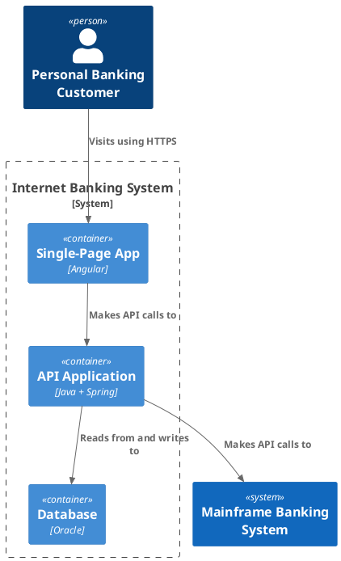

# C4 Model Architecture Diagrams (Structurizr DSL)

**Quick Start:** Model the system once as Structurizr DSL → define one view per C4 level (Context → Containers → Components → Code) → render with the Structurizr CLI → embed the result inside the Markdown document.

> ⚠️ **IMPORTANT:** Never hand-draw C4 diagrams. Author the **Structurizr DSL workspace** (the single source of truth) and derive every view from it. This enforces C4's abstraction rules and keeps the architecture model versionable and diffable.

## What is C4

The **C4 model** (Simon Brown, c4model.com) describes a software system at four levels of abstraction, from the highest (system context) to the lowest (code). Each level answers a different question for a different audience.

| Level | Name | Answers | Audience | Elements |
|---|---|---|---|---|
| 1 | **Context** | What does the system do, and who uses it? | Everyone | People + software systems |
| 2 | **Containers** | What is the high-level shape, and where does the tech live? | Technical people | Containers (apps, DBs, services) |
| 3 | **Components** | What are the major structural building blocks inside one container? | Developers / architects | Components |
| 4 | **Code** | How is each component implemented? *(fine-grained, optional)* | Developers | Classes / interfaces |

## Critical Rules

1. **One model, many views.** Write a single `workspace { model { … } }` and add a `views { … }` section per C4 level. Never duplicate the model per diagram.
2. **Respect the abstraction levels.** A Context view must not contain containers or components; a Containers view must not contain components. C4's value is the enforced hierarchy — don't flatten it.
3. **The diagram lives in the Markdown document** (this repo's model), not as a standalone file. Produce the rendered view *inside* the document.
4. **Code (level 4) is optional.** Model it only when the added precision is worth the maintenance cost; otherwise stop at Components.
5. **Two render paths** (below), both derived from the same DSL. Prefer SVG for fidelity; use a PlantUML/Mermaid fence when you want inline, diffable code.

## Authoring: the Structurizr DSL

The DSL is "models as code" — the reference implementation of C4. Full syntax: [references/dsl.md](references/dsl.md). The shape in one glance:

```dsl
workspace "Internet Banking System" "A model of the bank's software architecture." {

    model {
        customer = person "Personal Banking Customer" "A customer of the bank."
        mainframe = softwareSystem "Mainframe Banking System" "Core banking data."

        ibs = softwareSystem "Internet Banking System" "Online banking for customers." {
            spa = container "Single-Page App" "All banking functionality via the browser." "Angular"
            api = container "API Application" "Banking functionality via JSON/HTTPS." "Java + Spring" {
                controller = component "Account Controller" "Handles account requests." "Spring MVC"
            }
            db  = container "Database" "User data and access logs." "Oracle"
        }

        customer -> spa "Visits using HTTPS"
        spa -> api "Makes API calls to"
        api -> mainframe "Makes API calls to"
        api -> db "Reads from and writes to"
    }

    views {
        systemContext ibs "System Context" { include * autoLayout }
        container ibs "Containers" { include * autoLayout }
        component api "API Components" { include * autoLayout }
        styles {
            element "Person" { shape Person background #08427b color #ffffff }
            element "Software System" { background #1168bd color #ffffff }
            element "Container" { background #438dd5 color #ffffff }
            element "Component" { background #85bbf0 color #000000 }
        }
    }
}
```

## Render Path 1 — Inline SVG (native fidelity, recommended)

Export each view as SVG with the browser-based Structurizr renderer, then embed the result as raw HTML `<svg>` (no code fence) — the same pattern as the `architecture` / `infocard` skills. The engine's sanitizer already permits `svg`, so **no engine change is required**.

```bash
structurizr export -workspace workspace.dsl -format svg -output diagrams
```

This writes one `*.svg` per view. Paste the contents directly into the Markdown (raw HTML block, no empty lines inside the structure). SVG export uses the browser-based renderer and needs a Chromium/headless browser — see the `structurizr/puppeteer` scripts for automation, or use `structurizr/lite` (Docker) which renders and serves the SVG interactively.

> Highest fidelity: element shapes, arrow routing, and tags match the official Structurizr renderer exactly.

## Render Path 2 — PlantUML / Mermaid inline fence (repo-pattern consistency)

Export to PlantUML (C4-PlantUML dialect recommended) or Mermaid, then emit the result in a code fence — fully inline, diffable code, consistent with every other fence in Markdown Viewer.

```bash
structurizr export -workspace workspace.dsl -format plantuml/c4plantuml -output diagrams
structurizr export -workspace workspace.dsl -format mermaid -output diagrams
```



> ⚠️ **Caveat:** the PlantUML/Mermaid exporters do not support every shape and feature of the native renderer (this is exactly why Render Path 1 exists). Use Path 2 for quick inline diagrams; switch to Path 1 when fidelity matters. For Mermaid output, the viewer's Mermaid configuration must set `"securityLevel": "loose"` for the diagrams to render.

## The Four Levels

| Level | View keyword | Example | Notes |
|---|---|---|---|
| Context | `systemContext` | [examples/system-context.md](examples/system-context.md) | People + systems only |
| Containers | `container` | [examples/container.md](examples/container.md) | Apps, DBs, services inside one system |
| Components | `component` | [examples/component.md](examples/component.md) | Building blocks inside one container |
| Code | `component` + code elements | [examples/code.md](examples/code.md) | Classes/interfaces — optional |

## Best Practices

1. **Model top-down.** Start at Context and only drill into the levels the reader needs. A Context + Containers pair covers most cases.
2. **Use `autoLayout`** for clean initial layout, then adjust element positions manually only if a view needs it.
3. **Tag and style once.** Define `styles { element "Tag" { … } }` and apply `#tag` / `tags` to elements instead of styling each one inline.
4. **Keep descriptions short** — one sentence per element, one verb phrase per relationship.
5. **Treat the DSL as code.** Version it in the repo next to the document; the diagram is regenerated, never edited by hand.

## Common Pitfalls

- **Flattening levels** — putting a `container` inside a `systemContext` view (or a `component` in a `container` view). Each view must hold only its level's elements.
- **Hand-editing the output** — editing the exported SVG/PlantUML instead of the DSL. Regenerate from the DSL or the model drifts.
- **Empty lines inside an embedded raw `<svg>`** — can break parsing, exactly as with the `architecture` skill's raw-HTML rule.
- **Forgetting the Mermaid `securityLevel: "loose"`** — C4-exported Mermaid uses `{{…}}` node labels that strict securityLevel rejects.
