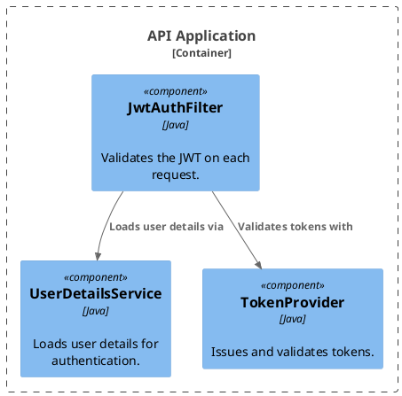

# Code (Level 4) — fine-grained / optional

The lowest level: how a component is implemented, down to classes and interfaces. **Model this only when the added precision is worth the maintenance cost** — in most systems, stop at Components (Level 3).

## Key Elements

The Structurizr DSL has no distinct "class" element. Code-level diagrams are expressed one of two ways:

1. **`component` elements styled as code** — declare the classes/interfaces as `component` elements (tagged `Code`) and render a component view scoped to their container. The approach used below.
2. **Imported code model** — pull in a workspace generated by a source-code scanner via `!include` (e.g. a JSON model from the Structurizr "extract" / `structurizr-class` tooling). This keeps the model synced to the real code.

## Step 1 — Author the model

```dsl
workspace "Internet Banking System" "Code-level view for the Security Component." {

    model {
        ibs = softwareSystem "Internet Banking System" "Online banking." {
            apiApp = container "API Application" "Banking API." "Java + Spring MVC" {
                authFilter    = component "JwtAuthFilter" "Validates the JWT on each request." "Java" "Code"
                userService   = component "UserDetailsService" "Loads user details for authentication." "Java" "Code"
                tokenProvider = component "TokenProvider" "Issues and validates tokens." "Java" "Code"
            }
        }

        authFilter -> tokenProvider "Validates tokens with"
        authFilter -> userService "Loads user details via"
    }

    views {
        component apiApp "Security Component — Code" {
            include *
            autoLayout
        }
        styles {
            element "Code" { background #dddddd color #000000 fontSize 22 }
        }
    }
}
```

## Step 2 — Render

```bash
structurizr export -workspace workspace.dsl -format svg -output diagrams
structurizr export -workspace workspace.dsl -format plantuml/c4plantuml -output diagrams
```

## Rendered view (C4-PlantUML fence)



> **When to skip:** if the class-level detail is stable and well-understood, a Components diagram plus the source code itself is usually the better reference. Reserve Code views for complex, hard-to-navigate components.
