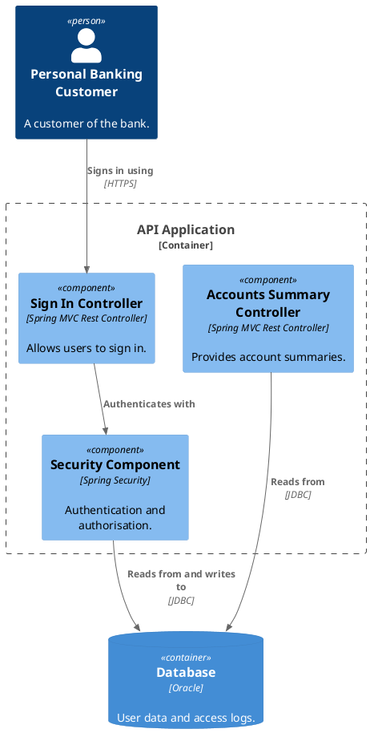

# Components (Level 3)

The major structural building blocks inside a single container. Components are declared inside their parent container's `{ … }`.

## Key Elements

- **Component** — a structural unit within a container (a controller, service, repository, client). Carries a technology as its third argument.
- A component view targets **one container** (`component <container>`), not the whole system.

## Step 1 — Author the model

```dsl
workspace "Internet Banking System" "Components view for the API." {

    model {
        customer = person "Personal Banking Customer" "A customer of the bank."

        ibs = softwareSystem "Internet Banking System" "Online banking." {
            api = container "API Application" "Banking functionality via a JSON/HTTPS API." "Java + Spring MVC" {
                signIn    = component "Sign In Controller" "Allows users to sign in." "Spring MVC Rest Controller"
                accounts  = component "Accounts Summary Controller" "Provides account summaries." "Spring MVC Rest Controller"
                security  = component "Security Component" "Authentication and authorisation." "Spring Security"
            }
            db = container "Database" "User data and access logs." "Oracle"
        }

        customer -> signIn "Signs in using" "HTTPS"
        signIn -> security "Authenticates with"
        security -> db "Reads from and writes to" "JDBC"
        accounts -> db "Reads from" "JDBC"
    }

    views {
        component api "API Components" {
            include *
            autoLayout
        }
        styles {
            element "Component" { background #85bbf0 color #000000 }
            element "Container" { background #438dd5 color #ffffff }
        }
    }
}
```

## Step 2 — Render

```bash
structurizr export -workspace workspace.dsl -format svg -output diagrams
structurizr export -workspace workspace.dsl -format plantuml/c4plantuml -output diagrams
```

## Rendered view (C4-PlantUML fence)


