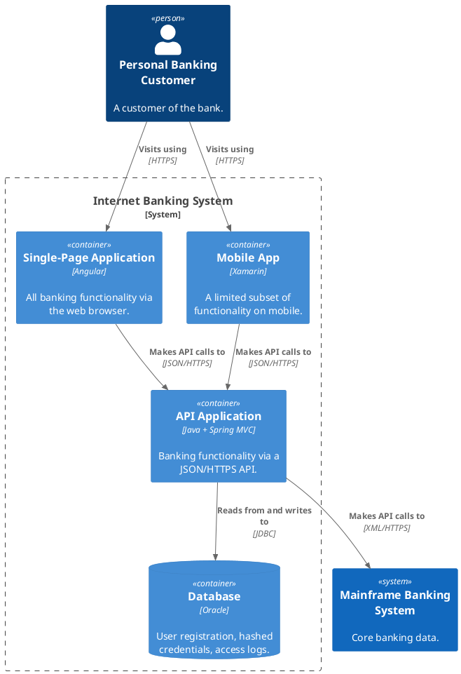

# Containers (Level 2)

The high-level technology shape: the containers (applications, databases, services) that make up the system in scope, and how they connect. No components — only containers.

## Key Elements

- **Container** — a separately deployable/runnable unit (web app, mobile app, API, database, message broker). Declared inside its parent system's `{ … }`.
- Each container carries a **technology** ("Angular", "Java + Spring", "Oracle") as its third argument.

## Step 1 — Author the model

```dsl
workspace "Internet Banking System" "Containers view." {

    model {
        customer = person "Personal Banking Customer" "A customer of the bank."
        mainframe = softwareSystem "Mainframe Banking System" "Core banking data."

        ibs = softwareSystem "Internet Banking System" "Online banking for customers." {
            spa     = container "Single-Page Application" "All banking functionality via the web browser." "Angular"
            mobile  = container "Mobile App" "A limited subset of functionality on mobile." "Xamarin"
            api     = container "API Application" "Banking functionality via a JSON/HTTPS API." "Java + Spring MVC"
            db      = container "Database" "User registration, hashed credentials, access logs." "Oracle"
        }

        customer -> spa "Visits using"
        customer -> mobile "Visits using"
        spa -> api "Makes API calls to" "JSON/HTTPS"
        mobile -> api "Makes API calls to" "JSON/HTTPS"
        api -> mainframe "Makes API calls to" "XML/HTTPS"
        api -> db "Reads from and writes to" "JDBC"
    }

    views {
        container ibs "Containers" {
            include *
            autoLayout
        }
        styles {
            element "Person" { shape Person background #08427b color #ffffff }
            element "Software System" { background #1168bd color #ffffff }
            element "Container" { background #438dd5 color #ffffff }
        }
    }
}
```

## Step 2 — Render

```bash
structurizr export -workspace workspace.dsl -format svg -output diagrams
structurizr export -workspace workspace.dsl -format plantuml/c4plantuml -output diagrams
```

## Rendered view (C4-PlantUML fence)


