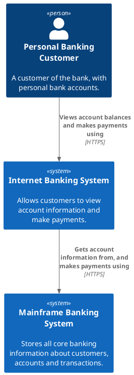

# System Context (Level 1)

The highest-level view: the system in scope, the people who use it, and the other software systems it interacts with. No containers or components here — only people and systems.

## Key Elements

- **Person** — a human user/role (internal or external).
- **Software system** — the system in scope, plus any system it depends on.
- **Relationship descriptions** read as verb phrases and carry the interaction intent.

## Step 1 — Author the model

```dsl
workspace "Internet Banking System" "System context for the bank's online banking." {

    model {
        customer  = person "Personal Banking Customer" "A customer of the bank, with personal bank accounts."
        mainframe = softwareSystem "Mainframe Banking System" "Stores all core banking information about customers, accounts and transactions."

        ibs = softwareSystem "Internet Banking System" "Allows customers to view account information and make payments." {
            # containers are declared here but NOT shown at this level
        }

        customer -> ibs "Views account balances and makes payments using"
        ibs -> mainframe "Gets account information from, and makes payments using"
    }

    views {
        systemContext ibs "System Context" {
            include *
            autoLayout
        }
        styles {
            element "Person" { shape Person background #08427b color #ffffff }
            element "Software System" { background #1168bd color #ffffff }
        }
    }
}
```

## Step 2 — Render

```bash
structurizr export -workspace workspace.dsl -format svg -output diagrams      # inline SVG (fidelity)
structurizr export -workspace workspace.dsl -format plantuml/c4plantuml -output diagrams  # fence
```

## Rendered view (C4-PlantUML fence)


