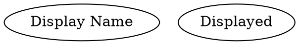
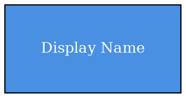
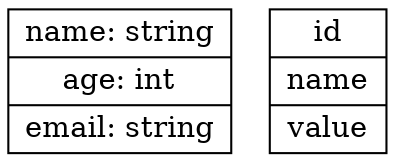
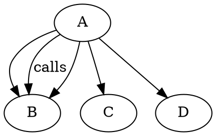
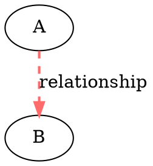
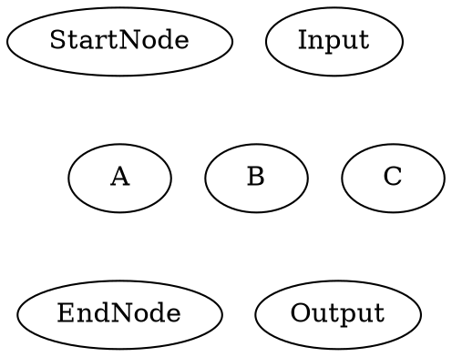
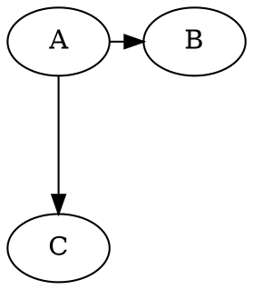
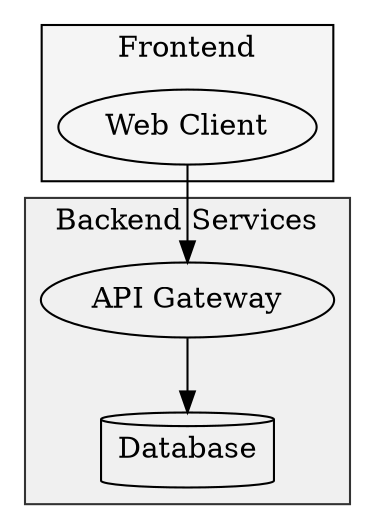
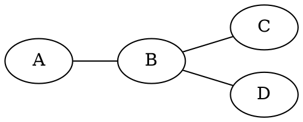

# Graphviz Syntax Reference

Detailed syntax rules for advanced graph features. Load this when you need specific syntax details.

---

## Node Definition

### Basic Syntax


### Node Attributes


### Record Nodes (Structured Data)


---

## Edge Definition

### Basic Syntax


### Edge Attributes


### Edge Styles

| Style | Description |
|-------|-------------|
| `solid` | Regular line (default) |
| `dashed` | Dashed line |
| `dotted` | Dotted line |
| `bold` | Thick line |
| `invis` | Invisible (for layout) |

### Arrow Heads

| Type | Description |
|------|-------------|
| `normal` | Standard arrow (default) |
| `open` | Open arrow tip |
| `none` | No arrow |
| `diamond` | Diamond end |
| `odiamond` | Open diamond |
| `dot` | Dot end |
| `box` | Box end |
| `crow` | Crow's foot (ER diagrams) |
| `vee` | V-shaped |

---

## Layout Control

### Layout Directions
```dot
digraph G {
    rankdir=TB;  // Top to Bottom (default)
    // rankdir=LR;  // Left to Right
    // rankdir=RL;  // Right to Left
    // rankdir=BT;  // Bottom to Top
}
```

### Node Ranking


### Spacing Control
```dot
digraph G {
    graph [
        nodesep=0.5,     // Horizontal spacing between nodes
        ranksep=1.0,     // Vertical spacing between ranks
        splines=ortho    // Edge routing: ortho|polyline|curved|line
    ];
}
```

### Edge Constraints


---

## Subgraph (Clustering)



**Note:** Cluster names must start with `cluster_` to render as boxes.

---

## Global Defaults


---

## Color Palette

| Color | Hex | Usage |
|-------|-----|-------|
| Green | `#2ECC71` | Success, completed |
| Red | `#E74C3C` | Error, critical |
| Orange | `#F39C12` | Warning, action |
| Blue | `#3498DB` | Info, process |
| Gray | `#95A5A6` | Neutral, disabled |
| Purple | `#9B59B6` | Concept, idea |
| Cyan | `#1ABC9C` | Secondary |
| Yellow | `#F1C40F` | Highlight |

---

## Node Shapes

### Common Shapes
| Shape | Description | Usage |
|-------|-------------|-------|
| `box` | Rectangle | Process, action |
| `ellipse` | Ellipse (default) | General node |
| `circle` | Circle | State, event |
| `diamond` | Diamond | Decision |
| `plaintext` | No border | Labels |
| `record` | Structured | Data tables |
| `cylinder` | Cylinder | Database |
| `folder` | Folder | Directory |
| `component` | UML component | Module |
| `house` | House | Root |
| `invhouse` | Inverted house | Leaf |

### HTML Labels


---

## Undirected Graphs



Use `graph` instead of `digraph`, and `--` instead of `->`.

---

## Troubleshooting

| Issue | Solution |
|-------|----------|
| Nodes not aligned | Use `rank=same` or invisible edges |
| Edges crossing | Try different `splines` or `rankdir` |
| Clusters not showing | Name must start with `cluster_` |
| Labels too long | Use `\n` for line breaks |
| Graph too wide | Switch to `rankdir=TB` |
| Overlapping nodes | Increase `nodesep` or `ranksep` |
