# Mermaid Syntax Reference

Detailed syntax rules for advanced diagram types. Load this when you need specific syntax details.

---

## Sequence Diagram Syntax

### Messages
```
->>   Solid line with arrow
-->>  Dashed line with arrow
-)    Solid line with open arrow
--)   Dashed line with open arrow
```

### Activation & Notes
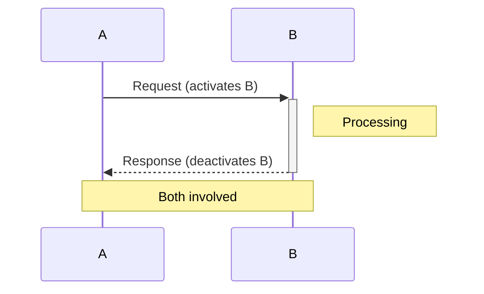

### Loops & Conditions
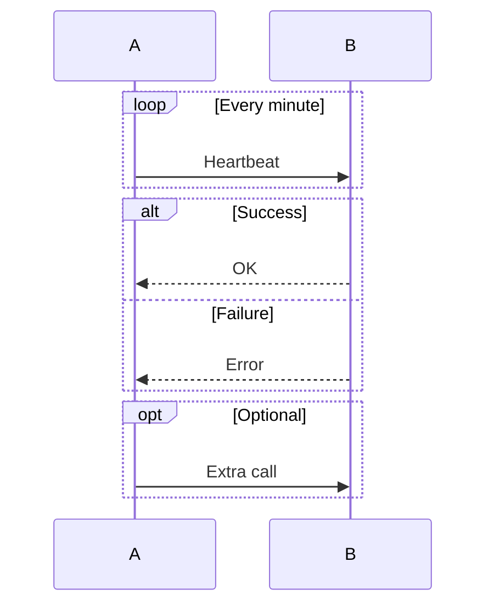

---

## Class Diagram Syntax

### Relationships
```
<|--  Inheritance
*--   Composition
o--   Aggregation
-->   Association
--    Link (solid)
..>   Dependency
..|>  Realization
```

### Class Definition
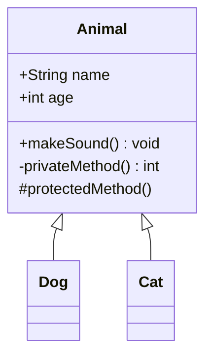

---

## ER Diagram Syntax

### Cardinality
```
||--||  One to one
||--o{  One to many
}o--o{  Many to many
||--o|  One to zero or one
```

### Example
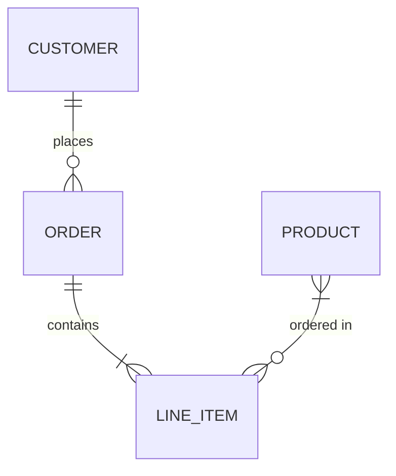

---

## Gantt Chart Syntax

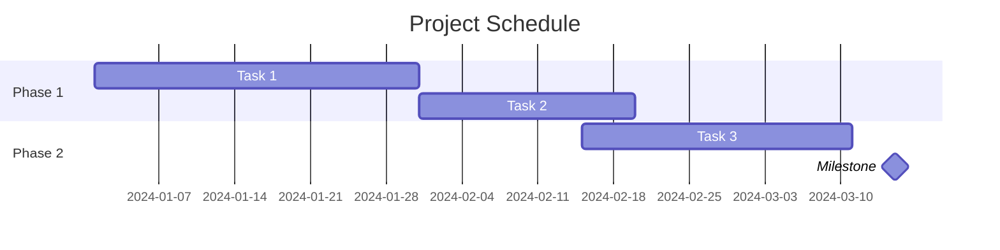

### Task Status
```
done     Completed task
active   Current task
crit     Critical path
```

---

## User Journey Syntax

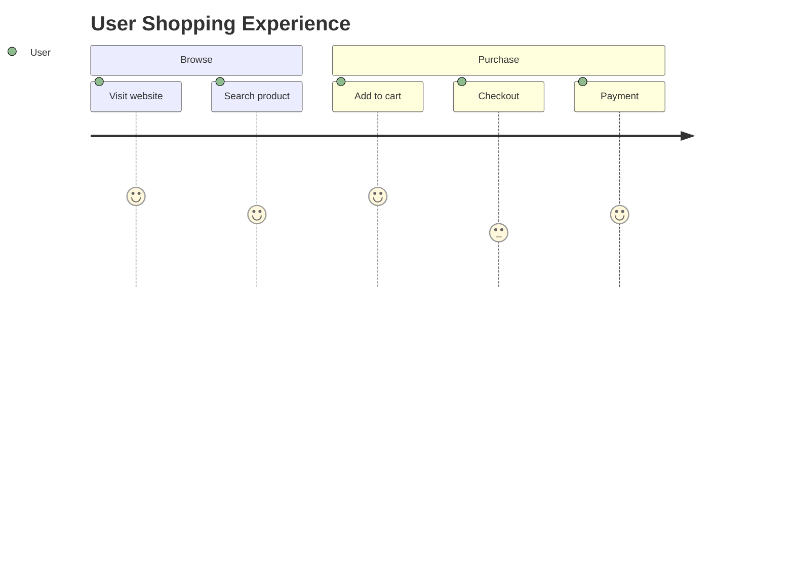

Score: 1 (bad) to 5 (great)

---

## XY Chart Syntax

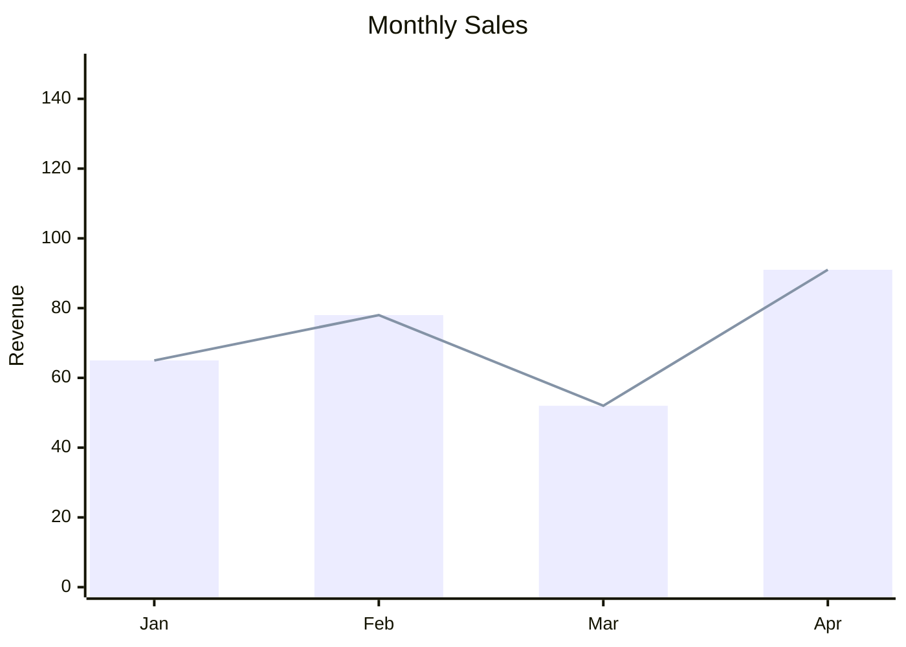

---

## Kanban Syntax

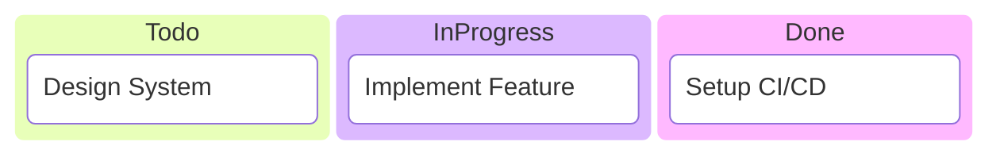

---

## Layout & Styling

### Directions
- `TB` / `TD` — Top to Bottom (default)
- `LR` — Left to Right
- `RL` — Right to Left
- `BT` — Bottom to Top

### Node Styling
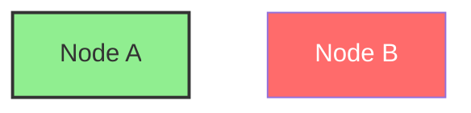

### Class Definitions
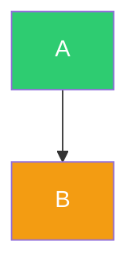

### Link Styling
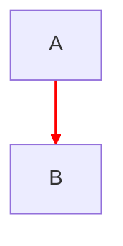

---

## Subgraph Advanced

### Nested Subgraphs
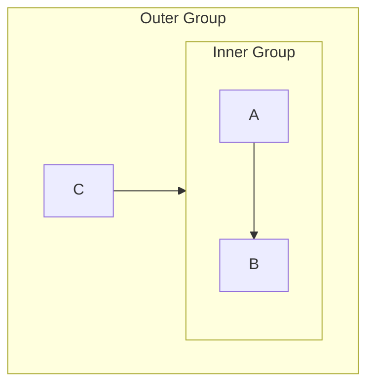

### Subgraph Direction
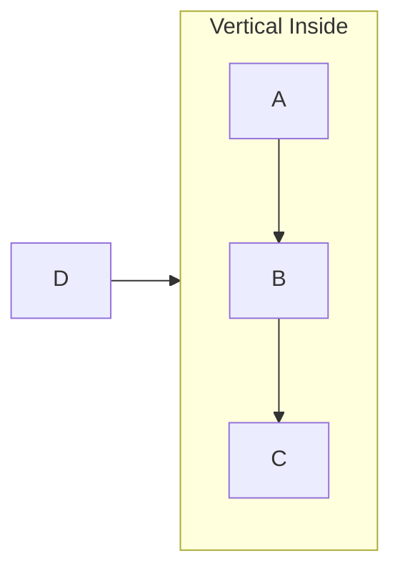
