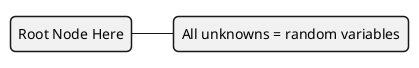
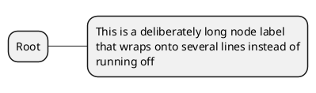
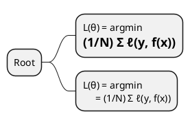

# Styling and Text Pitfalls

Four failure modes that render **without any error message**, so they are easy to ship
unnoticed. All four were reproduced against PlantUML 1.2025.2.

## 1. Text clipped on every box

The style parser reads **one property per line**. Collapsing several onto a single line
does not raise an error — it mis-parses the values and computes box widths *narrower than
the text*, so every node in the diagram loses a character off each edge (`1.5 Data`
renders as `.5 Data`).

Isolating it: `Padding 8` alone renders correctly, `Margin 6` alone renders correctly,
`Padding 8 Margin 6` on one line clips. The trigger is the second property on the line,
not any particular property.

## 2. One long label stretches the whole map

Mind map nodes do not wrap by default, so a single long label widens the entire diagram.
Set `MaximumWidth` on `node` to wrap instead.

## 3. Creole markup fires on wrapped lines

Creole is active inside node text, and it is evaluated per line. A continuation line after
`\n` that begins with a markup character is transformed:

| Line starts with | Renders as |
|---|---|
| `=` | Heading — large and bold |
| `-` | List item, and the `-` becomes `–` |
| `*` | Bullet list item |
| `#` | Numbered list item |
| `\|` | Safe — passes through literally |

This bites hardest on multi-line equations, where a continuation naturally starts with `=`:

Indenting the continuation by a single space defuses every case.

## 4. Combining diacritics do not render

Characters built from a base letter plus a combining mark (U+0300–U+036F) lose the mark.
`θ̂` (theta + combining circumflex) renders as a bare `θ` in the default font, and as a
misaligned `θˆ` in `Monospaced`. Setting `FontName Monospaced` additionally drops Unicode
subscripts such as `ₙ`.

Use an ASCII suffix (`θ^`, `x~`) or a **precomposed** character where one exists
(`ŷ` U+0177, `μ`, `σ`). Plain Unicode maths symbols are fine: `≜ ∈ ℝ Σ √ ≠ ≫ ⇒ → ᵀ ᴰ ₙ ₁ ²`.

## Pattern Notes

1. One style property per line — the single highest-value rule in this file.
2. Add `MaximumWidth` whenever nodes carry sentences rather than short phrases.
3. Indent any continuation line that starts with `=`, `-`, `*`, or `#`.
4. Prefer precomposed or ASCII-suffixed characters over combining diacritics.
5. None of these produce a warning, so verify by rendering, not by reading the source.
